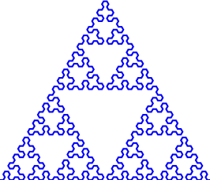
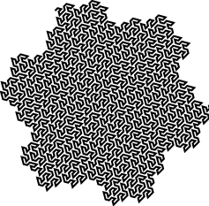

# L-system

Program for constructing [L-systems](https://en.wikipedia.org/wiki/L-system) and rendering their corresponding geometric structures through [turtle graphics](https://en.wikipedia.org/wiki/Turtle_graphics).

## L-systems
An L-system is a rewriting system and a type of formal grammar. An L-system consists of the following entities

* An alphabet of symbols that can be used to create strings.

* A set of production rules that each transform a symbol in the alphabet to a string of symbols.

* An initial axiom in the form of a string.

* A mechanism for translating a string into a geometric structure.

L-systems were origninally used for modelling plant cells and plant development. 

L-systems can be used for generating geometric structures such as self-similar fractals, e.g. [iterated function systems](https://en.wikipedia.org/wiki/Iterated_function_system).

## Samples





## Example: Koch curve

Define an L-system with the following properties

* The alphabet consits of the symbols: {F, +, -}

* The production rules are the following:

  * F &rarr; F+F-F-F+F

  * \+ &rarr; \+

  * \- &rarr; \-

* The inital axiom string is: F

* The mechanism for translating a string into a geometric structure can be explained as follows:
  
  Given a string containing the symbols in the alphabet. Iterate over the string of symbols and execute the following operations (imagine yourself holding down a pencil on a paper)

    * F: draw a straight line

    * +: rotate by 90 degrees

    * -: rotate by -90 degrees


This defines an L-system. Now we can with the help of the production rules start expanding the axiom string. By applying the production rules once we get

F &rarr; F+F-F-F+F

Applying the rules again we get

F+F-F-F+F &rarr; F+F-F-F+F+F+F-F-F+F-F+F-F-F+F-F+F-F-F+F+F+F-F-F+F

and we could go on like this reapplying the production rules.

For each string there exists a corresponding geometric structure which can be generated through the mechanism descrived above. Below you can see these structures after applying the production rules 0, 1, 2 and 3 times.


These images were generated with the following commands

```python
import lsystem

# Declare symbols in the language
v1 = lsystem.Variable("F", "F+F-F-F+F", 0, 10)
v2 = lsystem.Variable("+", "+", 90, 0)
v3 = lsystem.Variable("-", "-", -90, 0)

# Intialize the L-system
koch = lsystem.LSystem([v1, v2, v3], "F", []) 

# Evolve 
koch0 = koch.nextState("F")
koch1 = koch.nextState(koch0)
koch2 = koch.nextState(koch1)
koch3 = koch.nextState(koch2)

# also possible to evolve with n steps directly
# koch4 = koch.evolve(4)

# Print evolved strings
print("F")
print(koch0)
print(koch1)

# Render the structures
koch.draw("koch0.ps", koch0)
koch.draw("koch1.ps", koch1)
koch.draw("koch2.ps", koch2)
koch.draw("koch3.ps", koch3)
```
